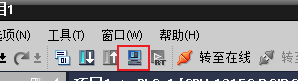

左侧:
  1. 语言和资源 - 项目文本 看一下
  2. 设备组态, 看右侧的网络视图 - 网络概览, 右侧展开大一些。看注释
  
# Download

- [Download](http://himachine.tpddns.cn:61000/%E5%8D%9A%E5%9B%BE/%E5%8D%9A%E9%80%94V16/Portal%20V16/)
- [Link](https://www.bilibili.com/read/cv9247679/) 公众号“山冰桐雨”，后台输入“PLC大作业”即可获得。 
- [国内 TIA2](https://www.jb51.net/softs/847765.html) [V18 | TIA_Portal_STEP7_Prof_Safety_WINCC_Adv_Unified_V18.iso + PLCSIM](https://pan.baidu.com/share/init?surl=V0KfTAitIZuHmepqQvBKMw#ssat) [--Link2](https://pan.baidu.com/s/1zrpufdThWr2YYQm-a-eYcg?pwd=bek7)
- [V19](https://pan.baidu.com/s/15c2PRYeCYV8z_5ZLi9-gqQ?pwd=92j6)
- [Link](https://plc4me.com/download-tia-portal-v18-full-googledrive/)
- [Step 7](https://plc247.com/download-step-7-microwin-smart-v2-7-googledrive/)
- [国内 TIA](https://www.xuezdh.com/pinpai/siemens/1898.html)
- [TIA V17](https://support.industry.siemens.com/cs/document/109784440/simatic-step-7-incl-safety-s7-plcsim-and-wincc-v17-trial-download?dti=0&lc=en-WW) [pan](https://pan.baidu.com/s/1YP5xa1SS30H7hoX0LCM6YA?pwd=668K)
- [TIA V18](https://support.industry.siemens.com/cs/document/109807109/simatic-step-7-incl-safety-s7-plcsim-and-wincc-v18-trial-download?dti=0&lc=en-WW)

# 工具栏

仿真按钮, 先点程序块，再点仿真

