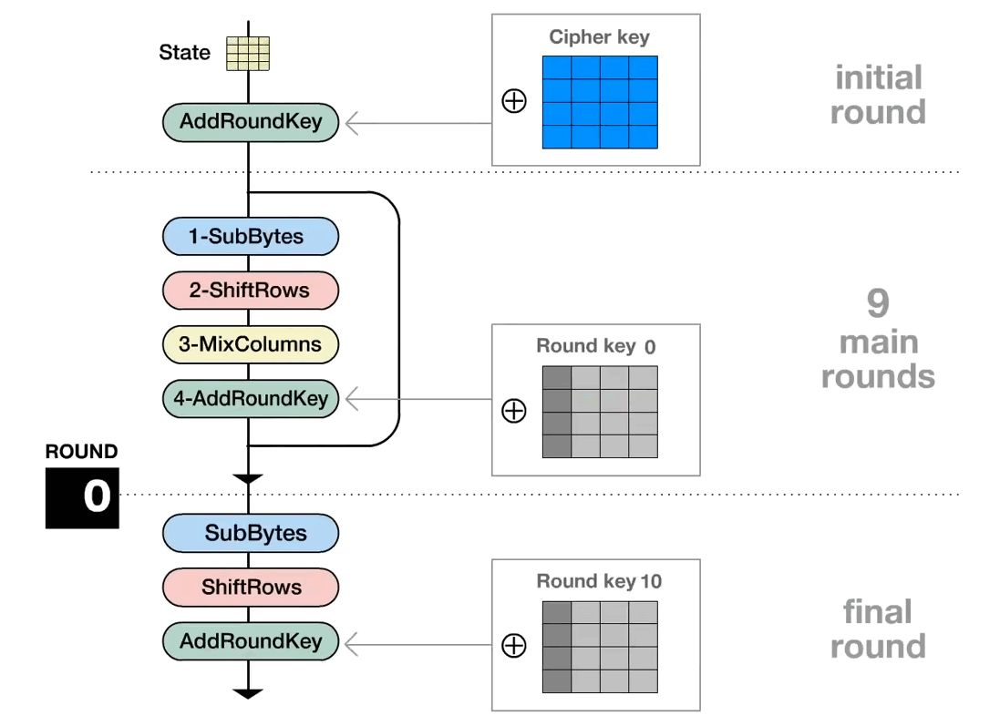

[Link](https://www.cnblogs.com/xiehongfeng100/p/4315395.html)

# 1-SubBytes 字节代换
定义 S盒 逆S盒, S盒不可逆

通过S盒将明文分组中的元素逐个替换 
# 2-ShiftRows 行位移
简单的左循环, 第n行(n为索引从0计), 就位移n字节

$$\begin{bmatrix}
00&01&02&03\\
04&05&06&07\\
08&09&0a&0b\\
0c&0d&0e&0f\\
\end{bmatrix}  \stackrel{ShiftRows }{\Longrightarrow} 
\begin{bmatrix}
00\\
01\\
02\\
03\\
\end{bmatrix} {\rightarrow}
\begin{bmatrix}
00&01&02&03\\
05&06&07&04\\
0a&0b&08&09\\
0f&0c&0d&0e\\
\end{bmatrix}  
 $$

# 3-MixColumns 列混合

$$\begin{bmatrix}
02&03&01&01\\
01&02&03&01\\
01&01&02&03\\
03&01&01&02\\
\end{bmatrix}

 \stackrel{MixColumns }{\Longrightarrow} 

\begin{bmatrix}
d4&e0&b8&1e\\
bf&b4&41&27\\
5d&52&11&98\\
30&ae&f1&e5\\
\end{bmatrix}
$$

通常

- AES-128 循环 10 次
- AES-192 循环 12 次
- AES-256 循环 14 次

