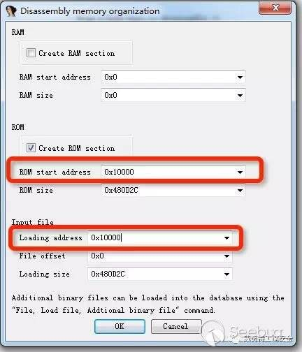

2022 第五空间鸿蒙
方式 1.
安装 jefferson # https://blog.csdn.net/u013071014/article/details/122426769
sudo apt-get install liblzo2-dev liblzma-dev
pip3 install git+https://github.com/sviehb/jefferson.git
binwalk -Me rootfs.img

- 再随便 file ./usr/bin/xxx 看文件架构 ELF 32-bit LSB executable 表示最低有效位 小端
  方式 2.取证大师

# IOT

IOT 车联网问题。启动不了找问题 patch 掉。可能是没有某些设备
ida 定位字符串。都 patch
qemu-arm -L ./tbox_app.bin

## 分析方式

4. binwalk file 有没有符号表
   1. 没有信息时
   2. binwalk -e file.bin
   3. binwalk -Me file
      , 再 binwalk file
1. Binwalk -A 命令来获取目标固件的 CPU 架构等信息(比如是 Big Endian 的指令)
1. 其次，使用 IDA Pro 加载 PowerPC big endian 架构的反汇编引擎进行分析。
   1. 比如找到 lis r9, ((unk_339AB8+0x10000)@h) 可能 0x10000 为固件加载地址。
1. 重新使用 IDA Pro 加载固件文件，并按照下图进行配置。配置完成后，IDA Pro 能够正常的分析固件的函数调用关系。



4. 脚本恢复符号表

## S19

[label](iot/re_iot_s19.md)

## 题目

[openwrt | AntCTF x D³CTF 2023 d3op 复盘笔记](https://mp.weixin.qq.com/s/97TfeJgZeG-lLzWc95teBw)

## STM32

[按这个配置](https://www.bilibili.com/video/BV1LX4y157TP/)
[IOT 安全——stm32 从做题到复现](https://www.anquanke.com/post/id/229321)
[[原创]STM32 固件逆向 ](https://bbs.kanxue.com/thread-272811.htm)
[stm32 芯片程序有 xtea 加密算法](https://bbs.kanxue.com/thread-272872.htm)
[一个简单的 STM32 固件分析](https://mp.weixin.qq.com/s/2XeF67Rz8Tz5jPVevSHhpg)
afx hex bin 文件 stm32 练习

ida 载入时

```
Processor Option
ARMv7-M , 确定
ROM start address: 0x8000000
ROM Size: 0x484
Loading start address: 0x8000000
```

## ardruino hex

https://stackoverflow.com/questions/17919704/arduino-disassemble-sketch-from-flash

[基于纯软件环境的 AVR 逆向分析](https://www.anquanke.com/post/id/202256)
[PolishDuck HCTF 2018](https://www.secpulse.com/archives/82690.html#PolishDuck)
[虎符 2020 密码机器(Misc)](https://0xffff.one/d/584/6)
Tool https://www.avrfreaks.net/projects/reavr?skey=ReAVR

```sh
avr-objdump -j .sec1 -d -m avr5 light.ino.hex
avr-objdump -Dx -m avr5 light.ino.hex
# 转bin, 用010也行自动的
avr-objcopy -I ihex -O binary light.ino.hex c9.bin
```

# Articles

- [安全竞赛中的 IoT 类题目环境部署方法研究](https://mp.weixin.qq.com/s/DRYEbNNUvXh4ECWgehmzbQ)
- [山石安研院 2022 年度安全研究精华汇](https://mp.weixin.qq.com/s/ubqxSpW3XxM4bcSj9_EHXA)
- [虚拟化安全｜从一道 CTF 题目学习 KVM](http://mp.weixin.qq.com/s?__biz=MzUzMDUxNTE1Mw==&mid=2247494743&idx=1&sn=2f3bede3835ac1874f4fc556df1603f4)
- [车联网安全入门之从 CAN 模拟环境搭建到重放攻击](https://mp.weixin.qq.com/s/LzrqCOq6BjPC6s3SjNvXcw)
- [物联网固件逆向工程基础](https://xz.aliyun.com/t/12320)
- [西湖论剑 IoT 复现（一）](https://mp.weixin.qq.com/s/xfkm4zwZ9e8OtQq--MH8fA)
- [2022 西湖论剑 IoT-AWD 赛题官方 WriteUp （上篇）：一号固件&二号固件](https://mp.weixin.qq.com/s/tRmWsRfF2yRszwSeXws5xg)
- [2022 西湖论剑 IoT-AWD 赛题官方 WriteUp （下篇）：三号固件](https://mp.weixin.qq.com/s/_1uLWXSPEiCFST6dsi0YBA)
- [解密固件实践及 firmwalker 脚本利用](https://www.bilibili.com/video/BV1Fs4y1K76J/)
- [分析固件解密流程](https://www.bilibili.com/video/BV1YL411m7nx/)
- [qemu 模拟路由器环境 TP-Link sr20 远程命令执行漏洞](https://www.bilibili.com/video/BV1jM411L7e6/)
- [例会分享之 iot 从提桶到跑路（1）](https://www.bilibili.com/video/BV1ok4y157Hw/)
- [记一次全设备通杀未授权 RCE 的挖掘经历](https://mp.weixin.qq.com/s/62WZmT3fWQjerjeqqRiTdw)
- [yichen 的信安知识库 物联网安全](https://www.yuque.com/hxfqg9/iot)
- [手把手玩转路由器漏洞挖掘系列 - 基础入门](https://mp.weixin.qq.com/s/-yUPKhjTpYEbzlVNRBo9XQ)
- [模拟运行](./index#模拟运行)
- [TP-Link WR740 后门漏洞复现](https://mp.weixin.qq.com/s/mcAOxhih8Yq8tZe0dAdInA)
- [D-Link DIR-820L 1.05B03 命令注入漏洞 CVE-2022-26258 复现](https://mp.weixin.qq.com/s/Hc2DHKBlKhSwEoFaquKgzw)
- [TOTOLINK CVE-2022-25084 漏洞分析&复现](https://mp.weixin.qq.com/s/hD0a_AQAtM8npD7mHizrIA)
- [Cisco RV340，RV340W，RV345 和 RV345P 从零开始复现 CVE-2023-20073](https://mp.weixin.qq.com/s/xCKzdaRq4D5svTc__tXPFQ)
- [锐捷 RG-EW1200G 远程代码执行漏洞(CVE-2023-3306)](https://mp.weixin.qq.com/s/N2WFXkEpbeFQ4wMrYJ0bMw)
- [手把手玩转路由器漏洞挖掘系列 - 固件加解密](https://mp.weixin.qq.com/s/mbL0MYNAjkPrMix6hg2CYw)

## IoT/car/汽车

- [汽车 CAN 总线-01 介绍](https://mp.weixin.qq.com/s/Jognd-QPI6J9wO6V9OjnoA)
- [深入理解 CAN 总线](https://mp.weixin.qq.com/s/dnZaM9rjhBImS0vQ5yLQ3A)
- [天刃 - 车联网安全渗透测试系统 测试 ivi、tbox、gw、分析固件以及逆向工程](https://mp.weixin.qq.com/s/nAJeM60ooKNF-AzZFx4ACw) [Github](https://github.com/TianWen-Lab/TranSec/) [Pan](https://pan.baidu.com/s/1jWFxiawgiC57gLCYiSvnyA#r4x7)


## 门卡 m1/ICCard/id

[tools proxmark3 pm3](https://proxmarkbuilds.org/)
[通过一道 CTF 题目学习 M1 卡的 AES 认证机制](https://mp.weixin.qq.com/s/PdJgVDsOnOAcid0DQTUrvg)
[实战｜记通过手机复制澡卡的辛酸历程](https://mp.weixin.qq.com/s/cDXyPFDeE6S_xGBL3NucPQ)

可能是大端 UTF8, GBK 都试试

```sh
\u5F20 张 \u4E09 三
5F 20 4E 09 20 30 34 30 34 30 39 00 00 00 00 00 # 张三 040409 (生日20040409)
31 38 38 38 38 38 38 38 38 38 38 20 35 38 30 00 # 18888888888 580 (手机号18888888888 余额580)
FF FF FF FF FF FF 08 77 8F 00 FF FF FF FF FF FF # 扇区分隔
00 00 00 00 13 66 13 47 13 36 13 E6 13 37 13 17 # 明显数据倒置了, 正常00是在最后面 改成 71 31 73 ...
```

### pm3

```sh
cd client
call setup.bat
proxmark3.exe
data load <file.bin>
trace load -f <file.trace>
```

## 渗透/SRC

- [物联网固件分析指南](https://www.bilibili.com/video/BV1rG411Y78x/)
- [嵌入式设备漏洞挖掘实战](https://mp.weixin.qq.com/s/AxkvdKdfBB_CPS0BadbcmA)
- [如何快速挖掘设备逻辑洞](https://mp.weixin.qq.com/s/jZd5BpAmwFZOZuNjc4-oqA)
- [如何进行物联网渗透测试？](https://mp.weixin.qq.com/s/-p9-9ia_4aqXwL9ELW-BYg)
- [路由器漏洞挖掘系列之未授权访问漏洞及常见绕过技巧](https://mp.weixin.qq.com/s/dQ9GL2wIME35uxAes3LzEg)
- [利用 MQTT 协议缺陷攻击内网物联设备](https://mp.weixin.qq.com/s/EtpaAw-fq4XJGyiojUVdiw)
- [针对基于 mavlink 协议的无人机进行攻击](https://mp.weixin.qq.com/s/HfFqgQcgOyA_rmb3UFXhww)
- [路由器挖掘基础教程-by-HRP](https://hgreed.vip/2023/08/02/%E8%B7%AF%E7%94%B1%E5%99%A8%E6%8C%96%E6%8E%98%E5%9F%BA%E7%A1%80%E6%95%99%E7%A8%8B-by-HRP/)
- [从命令注入到空指针：IoT 漏洞的挖掘](https://mp.weixin.qq.com/s/clNo72GdFnGShSQXuNHY3g)

## Coding

[随身 WiFi 硬改计划](https://mp.weixin.qq.com/s/sw4R-GOM8jwGdEvsLJL6pw)
